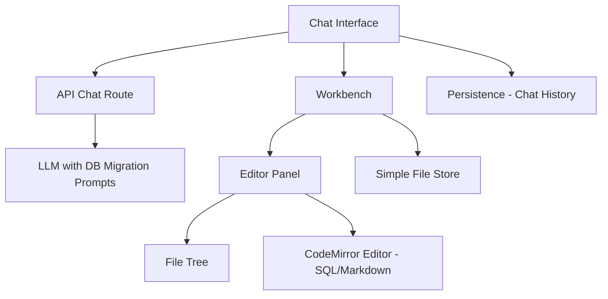

# Plan: Refactor for DB Migration Project

## Overview
This plan outlines the changes needed to transform the Bolt.new project into a DB migration-centric application. The goal is to remove web development features and focus on SQL/Markdown-based database migration workflows.

---

## Current Architecture Analysis

### Components to REMOVE (WebContainer/Code Execution)

| Component | Location | Reason |
|-----------|----------|--------|
| WebContainer | `app/lib/webcontainer/` | No need for in-browser code execution |
| Terminal | `app/components/workbench/terminal/` | No shell commands needed |
| Action Runner | `app/lib/runtime/action-runner.ts` | No shell/file actions needed |
| Shell Process | `app/utils/shell.ts` | No shell execution needed |
| Terminal Store | `app/lib/stores/terminal.ts` | No terminal needed |

### Components to MODIFY

| Component | Location | Changes |
|-----------|----------|---------|
| System Prompts | `app/lib/.server/llm/prompts.ts` | Rewrite for DB migration context |
| Workbench Store | `app/lib/stores/workbench.ts` | Remove artifact/action runner |
| Message Parser | `app/lib/runtime/message-parser.ts` | Simplify or remove artifact parsing |
| Files Store | `app/lib/stores/files.ts` | Remove WebContainer dependency |
| Editor Panel | `app/components/workbench/EditorPanel.tsx` | Remove terminal panel |
| Workbench | `app/components/workbench/Workbench.client.tsx` | Remove terminal toggle |

### Components to KEEP (with modifications)

| Component | Location | Notes |
|-----------|----------|-------|
| Chat Interface | `app/components/chat/` | Keep, already updated UI |
| Editor | `app/components/editor/` | Keep, already SQL/Markdown only |
| File Tree | `app/components/workbench/FileTree.tsx` | Keep for migration files |
| API Chat | `app/routes/api.chat.ts` | Keep, modify prompts |
| Persistence | `app/lib/persistence/` | Keep for chat history |

---

## Implementation Steps

### Phase 1: Remove WebContainer and Terminal

#### Step 1.1: Delete WebContainer-related files
- Delete `app/lib/webcontainer/` directory
- Delete `app/components/workbench/terminal/` directory
- Delete `app/lib/stores/terminal.ts`
- Delete `app/utils/shell.ts`

#### Step 1.2: Remove WebContainer imports from stores
- Modify `app/lib/stores/workbench.ts` - Remove WebContainer, ActionRunner, TerminalStore
- Modify `app/lib/stores/files.ts` - Remove WebContainer dependency

#### Step 1.3: Remove Terminal from EditorPanel
- Modify `app/components/workbench/EditorPanel.tsx` - Remove terminal panel and related code

#### Step 1.4: Remove Terminal Toggle from Workbench
- Modify `app/components/workbench/Workbench.client.tsx` - Remove terminal toggle button

### Phase 2: Simplify Artifact/Action System

#### Step 2.1: Remove Action Runner
- Delete `app/lib/runtime/action-runner.ts`

#### Step 2.2: Simplify Message Parser
- Modify `app/lib/runtime/message-parser.ts` - Remove action parsing, keep basic message handling
- Or create a simpler parser for DB migration context

#### Step 2.3: Remove Artifact Types
- Delete or simplify `app/types/artifact.ts`
- Delete or simplify `app/types/actions.ts`

### Phase 3: Rewrite System Prompts

#### Step 3.1: Create DB Migration System Prompt
Replace the current web development prompt with:

```typescript
export const getSystemPrompt = (cwd: string = WORK_DIR) => `
You are Bolt, an expert AI assistant specialized in database migrations and SQL development.

<system_constraints>
  You are helping users with database migration tasks including:
  - Writing SQL migration scripts (up and down migrations)
  - Creating Markdown documentation for migrations
  - Analyzing database schemas and suggesting improvements
  - Converting between different database dialects (PostgreSQL, MySQL, SQLite)
  
  You can create and edit:
  - SQL files (.sql) for migration scripts
  - Markdown files (.md) for documentation
  
  Use 2 spaces for code indentation.
</system_constraints>

<artifact_info>
  Bolt creates migration artifacts containing:
  - SQL migration scripts (up/down)
  - Markdown documentation
  - Schema analysis results
</artifact_info>
`;
```

### Phase 4: Simplify File Management

#### Step 4.1: Create Simple File Store
Replace WebContainer-based file store with a simpler in-memory or local storage solution:

```typescript
class SimpleFilesStore {
  files: Map<string, { content: string; type: 'file' | 'directory' }>;
  
  getFile(path: string) { ... }
  setFile(path: string, content: string) { ... }
  deleteFile(path: string) { ... }
}
```

### Phase 5: Update Dependencies

#### Step 5.1: Remove unused dependencies from package.json
Remove:
- `@webcontainer/api`
- `@xterm/xterm`
- `@xterm/addon-fit`
- `@xterm/addon-web-links`

---

## Files to Delete

| File/Directory | Reason |
|----------------|--------|
| `app/lib/webcontainer/` | WebContainer not needed |
| `app/components/workbench/terminal/` | Terminal not needed |
| `app/lib/stores/terminal.ts` | Terminal store not needed |
| `app/lib/runtime/action-runner.ts` | Action runner not needed |
| `app/utils/shell.ts` | Shell execution not needed |
| `app/routes/api.enhancer.ts` | Prompt enhancer not needed |

## Files to Modify

| File | Changes |
|------|---------|
| `app/lib/.server/llm/prompts.ts` | Rewrite for DB migration |
| `app/lib/stores/workbench.ts` | Remove WebContainer, ActionRunner, Terminal |
| `app/lib/stores/files.ts` | Remove WebContainer dependency |
| `app/lib/runtime/message-parser.ts` | Simplify artifact parsing |
| `app/components/workbench/EditorPanel.tsx` | Remove terminal panel |
| `app/components/workbench/Workbench.client.tsx` | Remove terminal toggle |
| `app/lib/hooks/useMessageParser.ts` | Simplify artifact handling |
| `package.json` | Remove unused dependencies |

---

## New Architecture



---

## Migration Workflow (Target)

1. User describes migration need in chat
2. AI generates SQL migration scripts
3. Scripts appear in editor for review
4. User can edit/modify scripts
5. User can save/export migration files

---

## Notes

1. **File Persistence**: Without WebContainer, files will be stored in memory or local storage. Consider adding export functionality.

2. **Preview Removal**: Already done in previous steps.

3. **Model Selector**: Keep for future model switching capability.

4. **GitHub Import**: Can be used to import migration scripts from repositories.

5. **Attach Menu**: Can be used to upload existing SQL files for analysis.

---

## Commands to Run After Changes

```bash
# Remove unused dependencies
pnpm remove @webcontainer/api @xterm/xterm @xterm/addon-fit @xterm/addon-web-links
```
