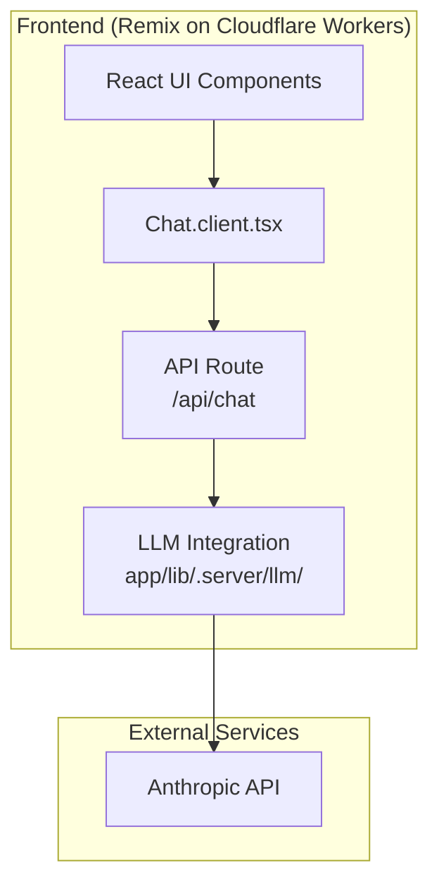
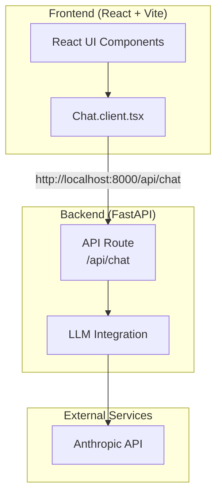

# Plan: Migrate from Remix/Cloudflare to FastAPI Backend

## Current Architecture



## Target Architecture



## Migration Steps

### Phase 1: Frontend Changes

1. **Remove Cloudflare-specific imports and code**
   - Remove `@remix-run/cloudflare` imports from:
     - [`app/entry.server.tsx`](app/entry.server.tsx)
     - [`app/root.tsx`](app/root.tsx)
     - [`app/routes/_index.tsx`](app/routes/_index.tsx)
     - [`app/routes/api.chat.ts`](app/routes/api.chat.ts)
     - [`app/routes/chat.$id.tsx`](app/routes/chat.$id.tsx)

2. **Convert to Vite + React**
   - Create new `vite.config.ts` for standard React (or adapt existing)
   - Replace Remix entry points with standard React `main.tsx`
   - Update routing to use `react-router-dom` instead of Remix

3. **Update API endpoint calls**
   - In [`app/components/chat/Chat.client.tsx`](app/components/chat/Chat.client.tsx:79):
     ```typescript
     // Change from:
     api: '/api/chat',
     // To:
     api: 'http://localhost:8000/api/chat',
     ```

4. **Keep IndexedDB persistence**
   - No changes needed - [`app/lib/persistence/db.ts`](app/lib/persistence/db.ts) runs client-side

### Phase 2: Backend Implementation

1. **Create FastAPI endpoint** in [`backend/main.py`](backend/main.py)
   - POST `/api/chat` - streaming chat endpoint

2. **Port LLM integration**
   - Move chat logic from [`app/lib/.server/llm/`](app/lib/.server/llm/) to FastAPI
   - Create `backend/services/llm.py` for Anthropic integration
   - Port [`app/lib/.server/llm/prompts.ts`](app/lib/.server/llm/prompts.ts) system prompts

3. **Update environment variables**
   - Add `ANTHROPIC_API_KEY` to [`backend/.env`](backend/.env)

### Phase 3: Configuration & Build

1. **Update build configuration**
   - Remove or update `wrangler.toml` (Cloudflare deployment)
   - Update `package.json` scripts for Vite dev server

2. **Add CORS configuration**
   - Update FastAPI CORS in [`backend/main.py`](backend/main.py) to allow frontend origin

## Files to Modify

| File | Action |
|------|--------|
| `app/entry.client.tsx` | Replace with standard React entry |
| `app/entry.server.tsx` | Remove (not needed for SPA) |
| `app/root.tsx` | Remove Remix imports |
| `app/routes/_index.tsx` | Convert to React component |
| `app/routes/api.chat.ts` | Remove - will be in FastAPI |
| `app/components/chat/Chat.client.tsx` | Update API URL |
| `vite.config.ts` | Update for React SPA |
| `backend/main.py` | Add chat API endpoint |
| `backend/.env` | Add ANTHROPIC_API_KEY |

## Notes

- The frontend uses IndexedDB for chat history persistence - this is client-side and won't be affected
- The system prompts in [`app/lib/.server/llm/prompts.ts`](app/lib/.server/llm/prompts.ts) are specialized for "Bolt" AI assistant - may need customization for DB migration agent use case
- Consider whether to keep the `/chat.$id.tsx` route functionality or simplify to single chat view
