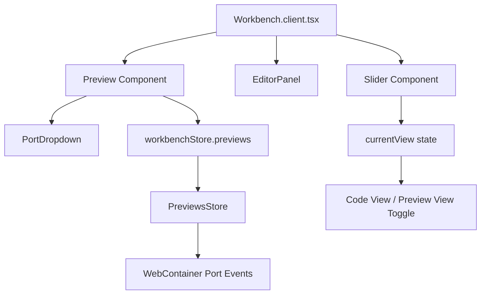

# Plan: Remove Preview Slider from Workbench

## Overview
This plan outlines the steps to remove the preview slider and preview functionality from the Bolt.new project. The goal is to keep only the code editor panel and remove the preview panel that slides in alongside the code.

## Architecture Analysis

### Current Preview System Flow

### Components Involved

| File | Purpose | Action |
|------|---------|--------|
| [`Workbench.client.tsx`](app/components/workbench/Workbench.client.tsx) | Main workbench container with slider toggle | Modify |
| [`Preview.tsx`](app/components/workbench/Preview.tsx) | Preview iframe component | Delete |
| [`PortDropdown.tsx`](app/components/workbench/PortDropdown.tsx) | Port selection dropdown | Delete |
| [`Slider.tsx`](app/components/ui/Slider.tsx) | Generic slider/toggle UI component | Delete |
| [`previews.ts`](app/lib/stores/previews.ts) | Previews store for WebContainer ports | Delete |
| [`workbench.ts`](app/lib/stores/workbench.ts) | Workbench store with currentView state | Modify |

---

## Implementation Steps

### Step 1: Modify Workbench.client.tsx

**File:** [`app/components/workbench/Workbench.client.tsx`](app/components/workbench/Workbench.client.tsx)

**Changes:**
1. Remove imports:
   - Remove `Slider` and `SliderOptions` from `~/components/ui/Slider`
   - Remove `Preview` from `./Preview`
   - Remove `WorkbenchViewType` from stores

2. Remove constants:
   - Remove `sliderOptions` object

3. Remove state/logic:
   - Remove `hasPreview` computed store
   - Remove `selectedView` store subscription
   - Remove `setSelectedView` function
   - Remove `useEffect` that auto-switches to preview

4. Remove JSX:
   - Remove `<Slider>` component from header
   - Remove the second `<View>` containing `<Preview />`

5. Simplify the component to only show `EditorPanel`

### Step 2: Modify workbench.ts Store

**File:** [`app/lib/stores/workbench.ts`](app/lib/stores/workbench.ts)

**Changes:**
1. Remove imports:
   - Remove `PreviewsStore` from `./previews`

2. Remove properties:
   - Remove `#previewsStore` private property
   - Remove `currentView` atom
   - Remove `previews` getter

3. Remove type:
   - Remove `WorkbenchViewType` type export

### Step 3: Delete Unused Files

Delete the following files that are no longer needed:

1. [`app/components/workbench/Preview.tsx`](app/components/workbench/Preview.tsx) - Preview iframe component
2. [`app/components/workbench/PortDropdown.tsx`](app/components/workbench/PortDropdown.tsx) - Port dropdown component
3. [`app/components/ui/Slider.tsx`](app/components/ui/Slider.tsx) - Slider toggle component
4. [`app/lib/stores/previews.ts`](app/lib/stores/previews.ts) - Previews store

---

## Detailed Code Changes

### Workbench.client.tsx - Before and After

**Before:** Contains slider toggle between Code and Preview views
**After:** Shows only EditorPanel without any toggle

### workbench.ts - Before and After

**Before:** 
- Has `currentView: WritableAtom<WorkbenchViewType>`
- Has `previews` getter from PreviewsStore
- Initializes PreviewsStore

**After:**
- Remove `currentView` state
- Remove `previews` getter
- Remove PreviewsStore initialization

---

## Files to Modify

1. **[`app/components/workbench/Workbench.client.tsx`](app/components/workbench/Workbench.client.tsx)** - Remove slider and preview view
2. **[`app/lib/stores/workbench.ts`](app/lib/stores/workbench.ts)** - Remove preview-related state

## Files to Delete

1. [`app/components/workbench/Preview.tsx`](app/components/workbench/Preview.tsx)
2. [`app/components/workbench/PortDropdown.tsx`](app/components/workbench/PortDropdown.tsx)
3. [`app/components/ui/Slider.tsx`](app/components/ui/Slider.tsx)
4. [`app/lib/stores/previews.ts`](app/lib/stores/previews.ts)

---

## Notes

- The WebContainer functionality is still used by other parts of the application (files store, terminal store, action runner)
- This change only removes the preview panel UI and its associated store
- The terminal toggle button in the code view header should be preserved
